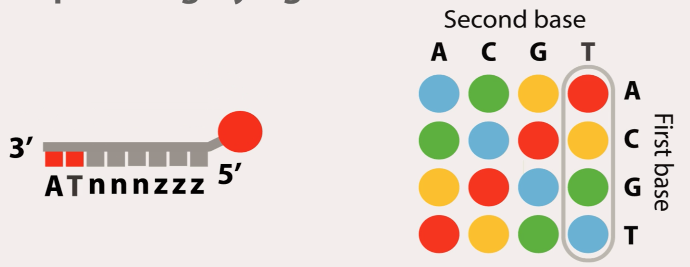

# Next Generation Sequencing

- WGS
- Exome-Seq
- RNA-Seq
- Methyl-Seq

## Sanger

- routine sequencing applications
- validate NGS data
- DNA polymerase + ssDNA template + template primer in mixture of
  di-deoxynucleotides (lack 3' OH terminal group, fluorescent dye) that
  terminate chain
- generates many copies of different length fragments
- fragments loaded into sequencing machine, either manually on slab gels or
  capillary electrophoresis tube (separation by fragment size)
- flow through, use laser/detector to track nucleotide type

## NGS Systems

- Illumina MySeq
- Illumins HiSeq
- 454
- SOLiD
- Ion Proton

Common features:

### Sample Preparation

- library obtained via amplification or ligation with custom adapter sequences
- library is a collection of randomly sized DNA fragments
- library verified quantitatively and qualitatively
- want diverse set with minimal duplicate fragments

### Sequencing Machines

Method 1: Bridge PCR
- library fragment amplified on solid surface with covalently attached DNA
  linkers that hybridize library adapters

Method 2: Emulsion PCR
- amplification creates clusters of DNA each originating from a single library
  fragment
- each cluster will act as an individual sequencing reaction

### Data Output

- raw data presented on DNA chips
- collection of DNA sequences generated at each cluster

- differences lie mainly in details of sequencing reaction, four groups:
  1. Pyrosequencing
  2. Sequencing by synthesis
  3. Sequencing by ligation
  4. Ion Conductor sequencing

### Pyrosequencing

- sequencing reaction monitored through release of pyrophosphate during each
  nucleotide incorporation
- released pyrophosphate used in a series of chemical reactions resulting in
  the generation of light
- light emission detected by a camera
- sequencing proceeds by incubating one base at a time, measuring light
  emission (if any), degrading unincorporated bases, addition of another base

| Pros                                       | Cons                                               |
|:-------------------------------------------|:---------------------------------------------------|
| - large read length (comparable to Sanger) | - high reagent cost                                |
|                                            | - high error rates over strings of 6+ homopolymers |

### Sequencing by Synthesis

- step by step incorporation of reversibly fluorescent dye and terminator caps
  on nucleotides
- used by Illumina
- 4 NTs added to sequencing chip at the same time, after NT incorporation,
  remaining bases washed away, fluorescent signal read at each cluster,
  fluorescent molecule and terminator group cleaved and washed away

| Pros                                                       | Cons                                                                                          |
|:-----------------------------------------------------------|:----------------------------------------------------------------------------------------------|
| - overcome homopolymer issue due to terminated nucleotides | - increased error rate with increased read lengths (incomplete removal of fluorescent signal) |

### Sequencing by Ligation

- uses 16 8-mer oligonucleotide probes instead of DNA polymerase, each with
  one of 4 fluorescent dyes attached to its 5' end
- each octomer has two probe specific bases, and 6 degenerates

- sequencing begins by binding primer at adapter sequence and hybridization
  of appropriate probe, upon annealing, ligated to primer sequence, unbound
  oligonucleotides washed away, signal detected and reported, fluorescent signal
  and last 3 bases cleaved and next cycle commences
- after approximately 7 cycles of ligation, DNA strand denatured, another
  sequencing primer offset by one base used, in total 5 primers

| Pros                                                     | Cons                      |
|:---------------------------------------------------------|:--------------------------|
| - oligonucleotide probes used rather than DNA polymerase | - very short read lengths |

### Ion Semiconductor Sequencing

- release of H+ during sequencing reaction to detect sequence of a cluster
- each cluster located directly above a semiconductor transistor, capable
  of detecting changes in pH of the solution

| Pros                                                               | Cons |
|:-------------------------------------------------------------------|:-----|
| - similar to pyrosequencing, but less cost and more time efficient |      |

## Comparison of NGS Systems

number of coverage (depth) (whole genome requires min. 30x coverage)

| System                   | Human | Mouse | Arabidopsis thaliana | E. coli |
|:-------------------------|:------|:------|:---------------------|:--------|
| pyrosequencing           | 0     | 0     | 5                    | 151     |
| sequencing by synthesis  | 455   | 536   | 11k                  | 323k    |
| sequencing by ligation   | 97    | 114   | 2k                   | 69k     |
| ion conductor sequencing | 3     | 4     | 74                   | 2k      |
